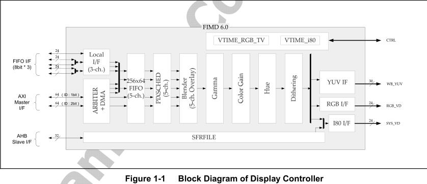

# lcd
___

## 介绍   

显示控制器支持从摄像头接口控制器的本地总线或者系统内存的视频缓存中传输数据到外部的LCD显示接口
显示驱动支持RGB，i80,YUV3种总线类型，使用高大5层支持多种颜色格式，256级alpha混合，颜色键，坐
标控制，软件滚动，多种窗口大小等的图像覆盖窗口。  
显示控制器支持颜色格式如：**RGB(1~24bpp)** 和 **(YCbCr 4:4:40)** 

## 控制流程 2

